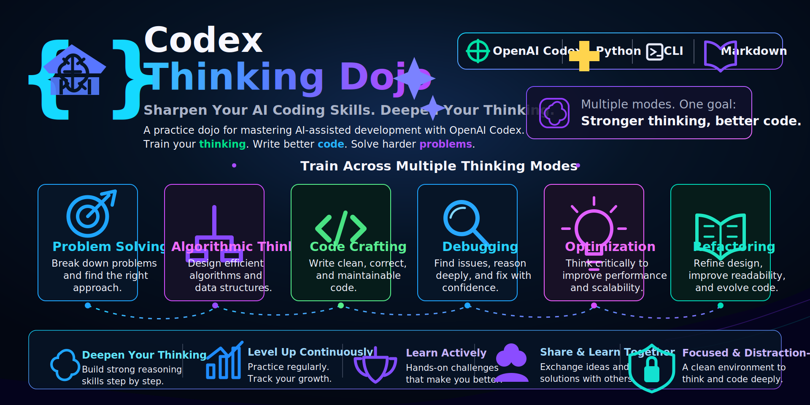

# Codex思考道場



Ollamaではなく、ローカルの **Codex CLI** に会話生成を任せる思考トレーニングアプリです。OpenAI APIキーは使いません。

## できること

- 対話: 問いを重ねて思考を深める
- 反論トレーニング: 主張の弱点をCodexに突いてもらう
- 意思決定ログ: 選択肢・基準・トレードオフを整理する
- アウトプット力: 要約や説明を採点する
- ニュース分析: 貼ったニュースを構造化してクイズ化する
- デイリーpt、ストリーク、プロフィール保存
- 直近30日の鍛錬ログ: GitHub contributions風の濃淡ヒートマップ
- 対話能力レーダー: 具体化・構造化・批判思考・意思決定・表現力を5角形で可視化

## 仕組み

```text
Browser
  -> local Node server
    -> codex exec
      -> Codex CLIの認証済みモデル
```

ブラウザから直接APIを叩かず、`server.js` が `codex exec` を呼び出します。  
そのため、Codex CLIにログイン済みであればAPIキーなしで使えます。

## 起動

```bash
cd codex-thinking-dojo
npm start
```

ブラウザで開きます。

```text
http://localhost:8787
```

## 利用モデル

デフォルトではトークン消費を抑えるために、軽量寄りの設定を使います。

- `CODEX_MODEL`: `gpt-5.4-mini`
- `CODEX_REASONING_EFFORT`: `low`
- `CODEX_VERBOSITY`: `low`
- `CODEX_MAX_HISTORY_MESSAGES`: `6`
- `CODEX_MAX_MESSAGE_CHARS`: `800`

Codex CLI側で使える別の値を環境変数で指定すると上書きできます。

```bash
CODEX_MODEL=gpt-5.2 CODEX_REASONING_EFFORT=medium npm start
```

## 動作確認だけしたい場合

Codexを呼ばずに仮返答でUIだけ確認できます。

```bash
CODEX_MOCK=1 npm start
```

## 注意

- 1往復ごとに `codex exec` を起動するため、Ollama直叩きより待ち時間は長めです。
- 会話履歴とプロフィールはブラウザの `localStorage` に保存されます。
- ニュース本文は自動取得せず、ユーザーが貼った内容をCodexが分析します。
- Codex CLIのバージョン差に対応するため、サーバーは `codex exec --help` を読んで、対応しているオプションだけを自動で渡します。

## トラブルシュート

### `unexpected argument '--ask-for-approval' found`

古い実装では `codex exec --ask-for-approval never` を固定で渡していました。  
現在の実装ではCodex CLIがそのオプションに対応している場合だけ渡すため、このエラーは出ない想定です。

修正後も同じエラーが出る場合は、古いサーバープロセスが残っている可能性があります。

```bash
pkill -f "node server.js"
npm start
```
